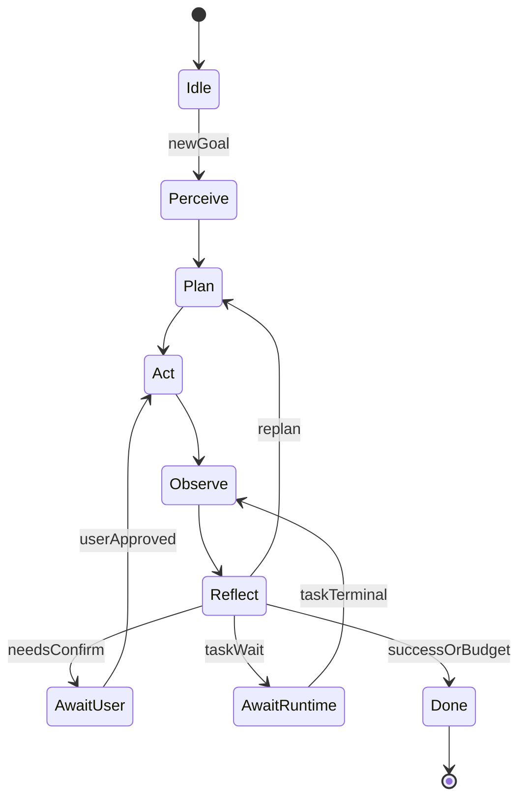
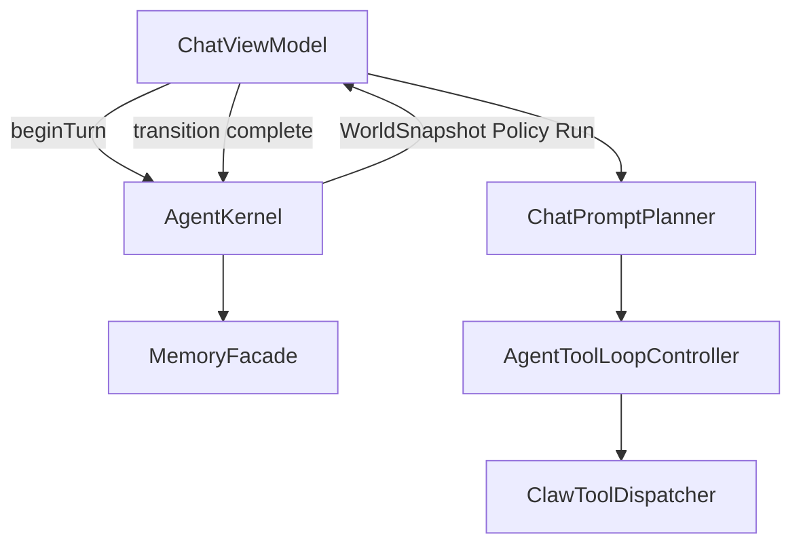

# Clawdroid Agent 架构（概念与结构）

> 与代码对齐的 Agent 权威入口。总架构见 [architecture.md](architecture.md)；改码边界见 [AGENTS.md](../AGENTS.md)。  
> 阶段进度见 [下一步计划.md](下一步计划.md) P2 / Agent 阶段 A–C。

## 1. 产品定位

Clawdroid Agent 是手机端 **Device Agent**：在能力画像约束下完成感知 → 规划 → 工具/Runtime 执行 → 观察 → 反思。  
不是通用桌面 Agent 框架（LangGraph 克隆），也不把高权限面扩到网络开放入口。

硬约束：

- App↔Runtime **只**走现有 JSON-over-UDS（见 [protocol.md](protocol.md)）
- **不做** WaitingSignal → Runtime 人工放行 IPC（协议未齐）
- 等待 Runtime 终态用 App 工具 `task_wait`；多 Agent 并行受 Runtime `max_concurrent_tasks` 约束
- 新逻辑落 `agent` / `ai` / `chat` / `skills` / `data`，禁止回流 `ChatViewModel` / `OverviewController`

## 2. 三类 Agent 语义

| 类型 | 含义 | 代码落点 |
|------|------|----------|
| **Conversation Agent** | 聊天会话内规划 → 工具环 → 总结 | `AiAgentOrchestrator` + `AgentToolLoopController` |
| **Catalog Agent** | 固定多步剧本（`InApp` / `RuntimeTask`） | `ClawAgentCatalog` + `ClawAgentRunner` |
| **Role Agent** | 带系统提示、工具子集、成功标准的可调度角色 | 阶段 C：`Supervisor`（规划中） |

## 3. 核心对象

| 对象 | 含义 |
|------|------|
| `AgentGoal` | 用户意图 + 成功标准 + 风险级 |
| `AgentPlan` | 有序/可并行步骤（工具、子 Agent、等待 Runtime task） |
| `AgentRun` | 一次执行实例：状态、预算钩子、关联 `task_id`、事件计数 |
| `AgentSession` | 跨多轮 Goal 的会话句柄（对齐聊天 `sessionId`） |
| `WorldSnapshot` | 能力画像摘要 + Runtime session 摘要 + 事件流是否开启 |
| `MemoryBundle` | working / episodic / semantic 检索拼装结果 |
| `PolicyDecision` | Allow / RequireConfirm / Reject |

包：`com.clawdroid.app.agent`（内核）；记忆门面：`com.clawdroid.app.data.MemoryFacade`。

## 4. 状态机（App 内核）

- 状态机在 **App AgentKernel**；Runtime 只提供 `task_*` 终态。
- `AwaitUser` 仅走 **App 内确认**（现有命令审核扩展），不是 Runtime 放行 IPC。
- `AwaitRuntime` 对齐 `task_wait` / 事件跟踪 / detach 软状态。

## 5. 运行时数据流（阶段 A）

阶段 A：**薄接线** — Kernel 创建 Run / 评估 Policy / 组装 Memory；仍由现有 Planner + Loop 执行，避免大爆炸重构。

## 6. 包边界

| 包 | 职责 |
|----|------|
| `agent/` | Session / Goal / Plan / Run / Policy / WorldSnapshot / Kernel |
| `ai/` | 模型回合、工具环、LoopDetector、压缩、反思提示 |
| `chat/` | 自然语言路由与提示拼装 |
| `skills/` | Catalog Agent / Skill |
| `tools/` | Dispatcher / Handlers / InputGuards |
| `data/` | Store + `MemoryFacade` |
| `ui/` | 观察 Run / 任务台 / 确认框；不实现长循环 |

## 7. 记忆

| 层 | Store | 用途 |
|----|-------|------|
| Episodic / 聊天检索 | `ChatContextIndexStore` | 历史轮次倒排 |
| Semantic / 事实 | `MemoryGraphStore` | 压缩摘要与事实节点 |
| Path grounding | `FileIndexStore` | 沙箱/已知路径 |

统一入口：`MemoryFacade.retrieve` / `indexUserTurn` / `clearAll`。  
阶段 B：检索侧 **去重**、**分项截断**、**总字符预算**（默认 ≤1800）；设置页治理仍可调各 Store / Facade。

## 7.1 阶段 B 能力

| 能力 | 落点 |
|------|------|
| 结构化反思 | `ToolReflectionCritique` + 失败启发式钩子写入工具环 SoftWarn；终态总结解析 JSON `ok/action/summary/hint` |
| Goal HITL | `PolicyDecision.RequireConfirm` → App 内「目标确认」卡（复用审查 UI）；**非** Runtime 放行 IPC |
| Run 持久化 | `AgentRunStore`：预算耗尽 / AwaitRuntime / AwaitUser 时落盘；用户发「继续」时 `AgentKernel.restoreRun` |
| 记忆策略 | `MemoryFacade` 去重 + 预算裁剪 |

## 8. 与 Runtime 的关系

- 高权限执行：`task_submit` →（可选自动 await）→ `task_wait` / `task_cancel`
- Catalog Agent `RuntimeTask` 模式：整剧本提交 Runtime
- **非目标**：WaitingSignal 人工放行 IPC；伪实现未齐协议

## 9. 阶段路线

| 阶段 | 内容 | 状态 |
|------|------|------|
| **A** | 本文档 + `agent` 内核骨架 + `MemoryFacade` + Chat 薄接线 + 单测 | 已落地 |
| **B** | 结构化反思、Goal 级 App HITL、`AgentRunStore`、记忆策略产品化 | 本轮落地 |
| **C** | Supervisor / Role Agent、任务台与 `task_*` 深同步、场景烟测 | 待办 |

延后：OCR / 截图理解 / 端云小模型；Xposed 深度业务默开。

## 10. 相关文档

- [architecture.md](architecture.md) §4
- [下一步计划.md](下一步计划.md)
- [基础方案设计.md](基础方案设计.md) §十 模型编排
- `ClawApp/app/src/main/assets/claw/INDEX.md`
