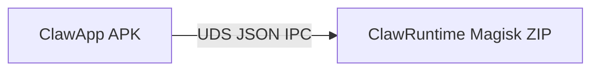
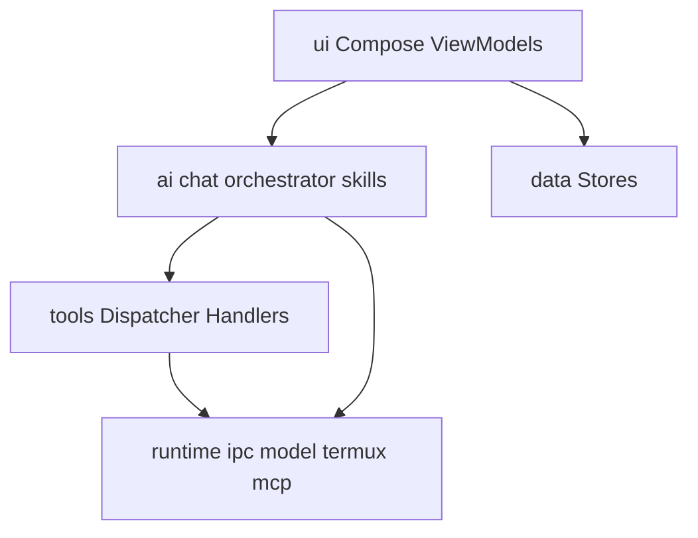

# Clawdroid 架构说明（当前）

> 与代码对齐的架构入口。历史对话导出见 [archive/](archive/)，非权威。

## 1. 双部署单元

- **ClawApp**：Brain Host — UI、模型、工具、无障碍、LSPosed 模块代码、Termux 桥、MCP。
- **ClawRuntime**：Root Executor — Go 守护进程 + Magisk 启动/配置/审计。

共享密钥与签名白名单必须同源配对，见模块 README。

## 2. 进程与隔离分层

| 层级 | 位置 | 强度 | 用途 |
|------|------|------|------|
| App 主进程 | `com.clawdroid.app` | 弱 | UI、编排、多数工具 |
| App `:sandbox` | `SandboxShellService` | 中（独立进程） | 白名单本地 shell |
| Termux UID | `com.termux` via `RUN_COMMAND` | 强（用户组件沙箱） | 完整终端环境 |
| ClawRuntime | Magisk root daemon | 最强 | 截图/注入/文件桥/受限 shell/`task_*` |

不伪造系统 Private Space API；跨用户启动 Termux 不稳定，故不采用。

## 3. App 内部层

- **工具唯一入口（产品路径）**：Chat / MCP → `ClawToolDispatcher` → `ToolHandler` → 域服务或 `ClawToolExecutor`。
- Overview 诊断卡可直连 `ClawToolExecutor` / Runtime，但**新功能**应优先走 Dispatcher，以便权限门与并发 lane 生效。
- **输入校验分层**：Compose 输入框（长度/控制字符）→ Handler 层 `InputGuards`（路径/Shell/写文件大小）→ Runtime 白名单与文件桥。MCP `tools/call` 不经 AI 参数校验，必须依赖 Handler/`InputGuards`。
- **Runtime 任务并行**：`task_submit` 受 `max_concurrent_tasks` / `max_inflight_tasks` 约束；事件 `task_state_changed` 含 `active_tasks`；shell 执行有 `job_id` 与有界 `shell_job_*` 监视；审计 JSONL 按体积轮转，服务日志 >5MB 轮转。
- **App 侧任务等待**：工具 `task_wait`（非 IPC action）包装 `RuntimeTaskPoller.awaitTerminal`；协程取消时补 `task_cancel`；本地轮询超时返回 `detached=true`（软状态，继续事件跟踪，不立刻 Failed）。
- **版本 / 能力对齐**：`RuntimeCompatSnapshot` 对比 App `EXPECTED_PROTOCOL_VERSION` + `expectedActions` 与 Runtime `actions`/protocol；概览 Runtime 磁贴与「运行诊断」显示 banner（模块过旧 / 协议不匹配 / 缺失动作），文案指向重装 Magisk ZIP。

## 4. Agent 与聊天循环

概念模型、三类 Agent、状态机与阶段路线见 **[agent-architecture.md](agent-architecture.md)**（权威）。

运行时路径（阶段 A 薄接线）：

1. `ChatViewModel.submitPrompt` → `MemoryFacade` 索引/检索 → `AgentKernel.beginTurn`（Goal / Policy / Run）
2. 可选 `ContextCompressor`（设置开关；压缩摘要写入 `MemoryGraphStore`）
3. `ChatPromptPlanner`：有附图时走 AI 多模态路径；否则 规则任务 → `DirectCommandOrchestrator` → `AiAgentOrchestrator`
4. 工具环：`AgentToolLoopController` + `ToolLoopDetector`
   - 连续失败 → 硬停
   - 无进展指纹 SoftWarn → **跳过执行**（合成「【系统】无进展」步骤，不调 `dispatcher.execute`）
   - 成功同参 → ReusePriorResult（注入摘要，不重跑）
5. 会话级 `maxModelApiCalls`；耗尽后状态「等待发送继续」，用户发「继续」重置预算
6. UI：`AgentRunEvent` 时间线（可折叠）；最终回复走 rich chat；`finishChat` 时 `AgentKernel.complete`
7. `TASK_SUBMIT` 后仍可自动 await；模型亦可主动 `task_wait`；UI 停止/取消与 Runtime `task_cancel` 协同

**附图（多模态）**：当前用户轮 OpenAI 兼容 `image_url` data URL / Anthropic `image` base64（编码器仍为 JPEG）；气泡可展示图/GIF/视频，`ChatHistoryStore` 可持久 `media` 元数据；送入模型的视觉载荷不进历史原文。Custom 路径明确拒绝视觉。

资产文案：`ClawApp/app/src/main/assets/claw/`（见 `INDEX.md`）。

## 5. Runtime IPC

- SSOT：`ClawRuntime/runtime/internal/ipc/actions.go`
- App 镜像：`RuntimeActionCatalog.kt`
- 校验：`scripts/check_runtime_catalog.py`
- 规范：[protocol.md](protocol.md)（当前 **21** 个动作，含 `list_dir_limited`）
- **读超时**：App `ClawRuntimeIpcClient` 按动作设 `soTimeout`（默认对齐 health `request_timeout_ms`≈10s；`exec_shell_limited`≈`timeout_ms+2s`；`capture_screen`≈45s；inspect/task≈10–15s；事件流握手后 `soTimeout=0`）
- **服务端 deadline**：处理 `exec_shell_limited` / `capture_screen` 前清除墙钟，结束后恢复，避免短于命令超时误杀

## 6. 设置导航

设置页为 **Hub → Category**（非第四底栏 Tab）：

- 外观 / 模型接入 / Agent 与工具 / 提示词与 Skills / 协助 MCP / Termux 与 Shell / 运行诊断

Agent 与工具：循环步数、API 预算、上下文压缩、工具允许列表（含 `task_wait`）。

Termux 与 Shell：`RUN_COMMAND` / Root 授权 / **坏容器清理**（`proot-distro remove` + 白名单 lock 清理，默认 `ubuntu`）。

运行诊断：Runtime 对齐 banner（App · Runtime · protocol · 缺失动作数）。

## 7. 已知技术债

- `OverviewController` 仍偏大（运行时生命周期 + 权限 + 事件），后续可拆；本轮未强制重写。
- `ConsoleComponents.kt` 仍为大型共享 Compose 库；按需再拆。
- WaitingSignal：本轮仅 UI 可取消 + 文案；**不做** App→Runtime 人工放行 IPC（协议未齐）。

## 8. 相关文档

- [agent-architecture.md](agent-architecture.md) — Agent 概念 / 内核 / 阶段 A–C
- [基础方案设计.md](基础方案设计.md) — 原则与长期路线
- [threat-model.md](threat-model.md)
- [assist-mcp.md](assist-mcp.md) / [xposed-adapters.md](xposed-adapters.md)
- 仓库根 [AGENTS.md](../AGENTS.md)
